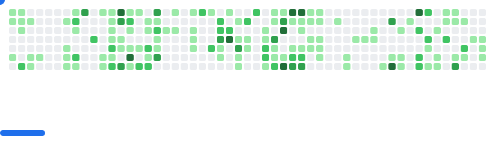

<h1> Hi, I'm <b><a href="https://wahyuivan.dev">Wahyu</a></b>!👋</h1>


<p>Currently working as a <strong>Software Engineer</strong> at <b><a href="https://incentro.com">Incentro</a></b></p>

<p>I'm passionate about sharing knowledge and building great software. Connect with me through the links below!</p>

### 📫 Connect with me
[](https://www.youtube.com/@wahyuivan9)
[](https://twitter.com/ivanwahyu195)
[](https://www.instagram.com/why.u9)

### 🚀 More about me 
```typescript
const AboutMe : any = {
  languages: [
      "Javascript",
      "Typescript",
      "HTML",
      "CSS",
      "Go",
      "Python",
      "Java",
      "PHP",
      "Kotlin"
  ],
  frameworks: ["React", "Node.js", "Laravel", "Vue"],
  databases: ["MySQL", "PostgreSQL", "SQLite"],
  clouds: ["GCP", "AWS", "Cloudflare"],
  techCommunities: {
    members: "GDG Bali",
    speakers: [
      "Devshare 2025",
      "ReactID Bali Meetup 2025",
      "Google I/O Extended Bali 2025"
    ],
    mentors: [
      "Dealls Super Mentor 🌟",
      "DuniaCoding Mentor"
    ]
  },
  quotes: "The world belongs to those who are consistent."
};
```
### 📝 Blog
- Personal blog: https://medium.com/@wahyuivan

### 📔 Latest Blog posts
- [Manfaatkan Built-in AI di Chrome: Langkah Awal untuk Web Developer](https://wahyuivan.medium.com/manfaatkan-built-in-ai-di-chrome-langkah-awal-untuk-web-developer-3c067a655230)
- [Pengen Nampilin Blog Medium-mu di Website Pribadi? Pakai Package Ini Aja!](https://wahyuivan.medium.com/pengen-nampilin-blog-medium-mu-di-website-pribadi-pakai-package-ini-aja-eb2bcd0c9926)
- [Mati Ketimpa state dan useEffect: How to Use It in a Better Way](https://wahyuivan.medium.com/mati-ketimpa-state-dan-useeffect-how-to-use-it-in-a-better-way-f10261407a83)

[](https://holopin.io/@whyu9)
---
<picture>
  <source
    media="(prefers-color-scheme: dark)"
    srcset="images/breakout-dark.svg"
  />
  <source
    media="(prefers-color-scheme: light)"
    srcset="images/breakout-light.svg"
  />
  
</picture>
